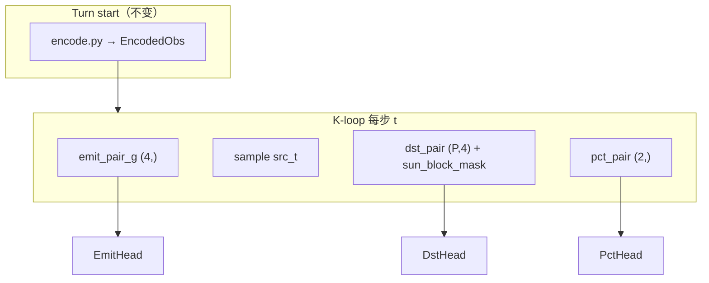

# DAY7 进展 — buf_mix 结论 → f25 特征 → f26 pair head

> **2026-05-28 更新**  
> 接续 [`DAY6_PROGRESS.zh.md`](DAY6_PROGRESS.zh.md)。  
> **项目综述（架构图 + 全流程）**：[`OVERVIEW.zh.md`](OVERVIEW.zh.md)

---

## 0. TL;DR — 当前状态

| 维度 | 状态 |
|---|---|
| **buf_mix** | ✅ 完成；@299 bin0=59% → **参数调参无效** |
| **v11_f25** | ✅ @299 replay 完成；bin0 **9.1%** ✅，但 spf/garr/flip **全 fail** → **已 pivot** |
| **v11_f26** | ✅ **代码已落地 + 本地 smoke 全绿**；🔴 **待 5090 开训** |
| **当前主线** | **v11_f26**：f25 编码器 + K-loop pair head（dst/emit/pct 各加标量特征 + sun 硬 mask） |
| **训练** | `bash scripts/run_v11_f26.sh`（**从头训，不 resume** f25/f26 以外 ckpt） |
| **决策标准** | **replay vs v20 only**（训练 spf/garr 不作 promote 依据） |

### 策略 pivot 链（Day7 一天内三次）

```
buf_mix 参数 sweep 无效
    → f25 turn-start 特征（+11 维）→ bin0 修好，行为仍畸形
        → f26 K-loop pair 特征（dst+4 / emit+4 / pct+2 + sun mask）→ 当前
```

**已停止的做法**：frozen_ratio / buffer_reset / ent_coef sweep；在旧 22-dim arch 上 resume；用 f25 模板 export f26 ckpt（已被 `HAS_PAIR_FEATS` 检查拦截）。

---

## 1. 问题诊断（贯穿 Day7）

### 1.1 症状 → 根因

| 阶段 | 症状 | replay 证据 | 根因 |
|---|---|---|---|
| buf_mix | bin0 ~60% 不动 | @299 59.3% @499 57.3% | pct head 缺 **相对容量** 信号；buffer 只改 garr 分布 |
| f25 | bin0 下来了，仍 1-ship spam | @299 bin0 **9.1%**，spf **1.40**，garr **6.87** | turn-start 特征帮了 pct；**dst/emit 仍不知几何/可行性/预算** |
| f26 目标 | 抽干母星、发太阳、多路 1-ship | f25 HTML replay 肉眼可见 | 需在 **K-loop 内** 给 dst/emit/pct 动态 pair 信号 |

### 1.2 决策铁律（重申）

1. **Promote 只看 replay vs v20**（first-80 gate + WLD + HTML 肉眼）
2. **训练 log 的 spf/garr 高 ≠ 实战好**（self-play 与 v20 对手分布不同）
3. **arch 维度变了 = 从头训**（f25、f26 均不可 resume 旧 ckpt）
4. **ablation 后置**：f26 先 a+b+c 合训一版，跑通 replay 后再拆

---

## 2. buf_mix 阶段（已结束）

### 2.1 配置

| 参数 | buf_from4k | buf_mix |
|---|---|---|
| buffer | v20 only | v20 + top10 50/50 |
| frozen_ratio | 0.50 | 0.35 |
| buffer_reset_ratio | 0.50 | 0.70 |
| resume | 4k @3199 | buf_from4k @799 |

### 2.2 Mid-replay 结果（first-80，5 局 vs v20）

| 指标 | buf_from4k @799 | buf_mix @299 | buf_mix @499 | Day5 目标 |
|---|---|---|---|---|
| bin0 | 61.0% | 59.3% | 57.3% | ↓（<40% 理想） |
| spf | 10.73 ✅ | 6.78 | 8.24 | >10 |
| garr | 107.5 ✅ | 91.12 | 91.11 | >60 ✅ |
| flip | 1.90% | 1.65% | 2.09% | >6% |
| emit=1/turn | ~25% | **74%** | **78%** | ↓ |
| WLD | 0/5 | 0/5 | 0/5 | — |

**结论**：spf/garr 有 buffer 增益，**pct 完全没动**；emit 退化为「单发 bin0 或 8 路 bin0 spam」。

### 2.3 根因表（历史 ckpt 对照）

| run | bin0 | 备注 |
|---|---|---|
| k8_no_emit @800 | **25.4%** | pct 最健康 ckpt（但 spf 低） |
| k8_4k @3199 | 72.1% | self-play 锁 bin0 |
| buf_from4k @799 | 61.0% | buffer 抬 spf 不修 pct |
| buf_mix @299 | 59.3% | top10 buffer 也不修 pct |

**Day7 上决策**：pivot 到 **特征工程（f25）**，不再调 buf_mix 参数。

---

## 3. v11_f25 阶段（已结束 → pivot f26）

### 3.1 做了什么

在 `encode.py` 增加 **+11 维 turn-start 特征**（planet 22→28，fleet 8→10，global 14→17），不改 head 结构：

| 类别 | 特征 | 作用 |
|---|---|---|
| pct 大舰队 | flip_cost_ratio, friendly_surplus, capturable_bin3/5, needed_pct_norm, max_garr_norm | 相对容量 → 推大 pct bin |
| emit 多路 | weak_target_score, n_weak_targets_norm, ships_to_capture_all_weak_norm | 软目标数量 → 推 emit≥2 |
| fleet | target_dist_norm, target_garrison_norm | 远程大舰队暗示 |

- config：`orbit_wars_rl/configs/multi_action_v11_f25.yaml`
- script：`scripts/run_v11_f25.sh`
- ckpt：`ckpt_multi_action_v11_f25/`
- submission：`submission_rl_v11_f25.py`（planet=28, global=17, **无 pair head**）

### 3.2 @299 replay 结果（first-80，5 局 vs v20）

| 指标 | f25 @299 | v20 (B) | Day5 gate | 判定 |
|---|---|---|---|---|
| **bin0** | **9.1%** | 1.1% | — | ✅ 大幅改善 |
| **emit≥2** | **60.0%** | 7.8% | >5% | ✅ |
| **spf** | **1.40** | 16.51 | >10 | ❌ |
| **garr** | **6.87** | 193.06 | >60 | ❌ |
| **flip** | **0.78%** | 18.11% | >6% | ❌ |
| zero_emit | 2.8% | 30.4% | — | — |
| WLD | **0/5/0** | 5/0/0 | — | ❌ |
| captures | 13 | 113 | — | ❌ |

**pct_bin 分布（first-80，A）**：bin0 9.1% / bin1 25.2% / bin2 29.2% / bin3 2.3% / bin4 7.6% / bin5 7.8% / bin6 1.1% / bin7 17.6%

**emit_count（first-80）**：0: 5.8% / 1: 34.2% / 2–8: 60%（多路确实起来了）

### 3.3 f25 诊断（HTML replay + 指标）

| 现象 | 含义 |
|---|---|
| bin0 从 ~60% → 9% | turn-start pct 特征 **有效** |
| emit≥2 60% 但 spf 1.4 | **多路 1-ship spam**，不是大舰队 |
| garr 6.87 | **快速抽干母星**，不留守备 |
| flip 0.78% | 舰队太小/目标不对，**几乎不 flip** |
| 往太阳/出界发 | dst head **缺几何约束** |

**Day7 下决策**：f25 只解决了「选 10%」；没解决「往哪打、该不该再发、这一对送多少」。→ **f26 pair head**。

---

## 4. v11_f26 阶段（当前主线）

### 4.1 设计思路

f25 特征在 **turn 开始时编码一次**；f26 在 **K-step 自回归 loop 内** 按当前 `reserved`、已选 `src/dst` 动态计算，直接喂给三个 head 的 fc1 输入（**不改** planet/fleet/global 编码维度，仍为 28/10/17）。



### 4.2 Pair 特征一览

**DstHead — 每个候选 dst 4 维 + 硬 mask**

| 索引 | 名称 | 公式 / 含义 |
|---|---|---|
| 0 | dist_src_dst_norm | src→dst 距离 / BOARD |
| 1 | sun_risk | 1 − min_dist(path, sun) / SUN_GUARD；≥0.9 → **logit −∞** |
| 2 | ships_needed_norm | (garr_dst+1) / remaining_src |
| 3 | pair_flip_bin5 | floor(rem·0.7) > garr_dst 且为敌/中立 |

**EmitHead — 每步全局 4 维**

| 索引 | 名称 | 含义 |
|---|---|---|
| 0 | n_feasible_pairs_norm | 可 flip 的 (src,dst) 对数 / MAX_PLANETS |
| 1 | best_pair_margin_norm | 最好一对的 margin（log1p 归一化） |
| 2 | home_remain_ratio | 母星 remaining / home_init |
| 3 | total_remain_ratio | 全军 remaining / total_init |

**PctHead — 选定 (src,dst) 2 维**

| 索引 | 名称 | 含义 |
|---|---|---|
| 0 | pair_needed_pct | (garr_dst+1) / remaining_src |
| 1 | pair_flip_bin5_pair | bin5(70%) 能否 flip 该 dst |

### 4.3 Head fc1 输入维度（d_model=128, K=8）

| head | f25 | f26 | Δ |
|---|---|---|---|
| dst_fc1 | 257 = 2·d+1 | **261** = 2·d+5 | +4 pair |
| emit_fc1 | 137 = 2·d+K+1 | **141** = 2·d+K+5 | +4 pair_g |
| pct_fc1 | 385 = 3·d+1 | **387** = 3·d+3 | +2 pair |

`infer_arch_from_flat()` 通过 fc1 shape 自动识别 `has_pair`；export 用模板内 `SUN_BLOCK_THRESH` 行区分 f25/f26，**互混会报错**。

### 4.4 代码清单（已实现）

| 模块 | 路径 |
|---|---|
| pair 特征计算 | `orbit_wars_rl/features/pair.py` |
| JAX heads + K-loop | `orbit_wars_rl/net/heads.py`, `orbit_wars_rl/net/model.py` |
| NumPy 推理镜像 | `orbit_wars_rl/inference/numpy_forward.py` |
| Rollout 扩展 | `orbit_wars_rl/ppo/rollout.py`（+planet_x/y/home_idx） |
| Kaggle 单文件 | `submission_rl_v11_f26.py` |
| config / launch | `orbit_wars_rl/configs/multi_action_v11_f26.yaml`, `scripts/run_v11_f26.sh` |
| replay 路由 | `scripts/quick_replay.sh`（has_pair→f26 模板） |

### 4.5 本地验证（Mac CPU，2026-05-28）

| 检查项 | 结果 |
|---|---|
| parity fresh-init 16 states | **16/16 OK** |
| init → rollout → ppo_loss | fc1 维 141/133/195 ✅ |
| export + parity d_model=128 | **8/8 OK**；agent smoke `[0, π/2, 84]`（pct_bin=5=70%） |
| f26 ckpt + f25 模板 | **正确拒绝**（HAS_PAIR_FEATS mismatch） |

### 4.6 训练配置

| 项 | 值 |
|---|---|
| config | `orbit_wars_rl/configs/multi_action_v11_f26.yaml` |
| script | `scripts/run_v11_f26.sh` |
| ckpt | `ckpt_multi_action_v11_f26/` |
| log | `logs/v11_f26.log` |
| tensorboard | `logs/v11_f26/` |
| seed | 260 |
| updates | 800（ckpt 每 100 upd） |
| ent_coef_pct | **0.004**（比 f25 0.006 略低，pair 先验更强） |
| frozen_ratio | 0.40 |
| buffer | **本 run 不用**（f26 跑通 gate 后再 mix） |
| resume | **禁止** resume f25 或更早 ckpt |

---

## 5. 下一步：执行命令

### 5.1 5090 开训（标准流程）

```bash
# 1) 同步代码到 5090（不会删 data/*.npz）
bash sync_mirror_ultrapp.sh

# 2) 5090 上启动 f26 训练（后台，写 logs/v11_f26.log）
bash scripts/run_v11_f26.sh
# 输出 pid=... 后：

# 3) 实时看训练 log
tail -f logs/v11_f26.log
```

**注意**：f26 与 f25 **不可并行**占同一块 GPU；若 f25 仍在跑，先 `kill` 旧进程再开 f26。

### 5.2 中途 checkpoint replay（@299 必做，@799 决策）

```bash
# @299 早期信号（约 1/3 进度，ckpt_000299.pkl）
bash scripts/quick_replay.sh \
  ckpt_multi_action_v11_f26/ckpt_000299.pkl \
  v11_f26_u299

# @799 完整 run 决策
bash scripts/quick_replay.sh \
  ckpt_multi_action_v11_f26/ckpt_000799.pkl \
  v11_f26_u799
```

`quick_replay.sh` 会自动：export → `submission_rl_v11_f26.py` → 5 局 vs v20 → JSON + **first-80 gate 摘要**。

### 5.3 视觉检查（发太阳 / 抽干母星 / 多路 spam）

先 export，再跑 HTML replay（单局 ~30–120s）：

```bash
# export（若 quick_replay 已生成 submission 可跳过）
python3 -m orbit_wars_rl.scripts.export_submission \
  --ckpt ckpt_multi_action_v11_f26/ckpt_000299.pkl \
  --template submission_rl_v11_f26.py \
  --out submission_rl_v11_f26_u299.py

# 生成可交互 HTML
python3 -m orbit_wars_rl.scripts.replay_html \
  --agent-a submission_rl_v11_f26_u299.py \
  --agent-b submission_v20_0513.py \
  --seed 0 \
  --out-dir logs/replay_html/v11_f26_u299_seed0

# 浏览器打开
#   logs/replay_html/v11_f26_u299_seed0/replay.html
```

**肉眼 checklist**（前 80 turn）：

- [ ] 是否仍大量 fleet 指向太阳或地图外缘
- [ ] 母星 garrison 是否在前 20 turn 被抽干到个位数
- [ ] emit≥2 时是否仍是 1-ship 多路（spf≈1）还是开始有 10+ ship 舰队
- [ ] 是否出现对 neutral/enemy 的有效 capture（planet 颜色变化）

### 5.4 f26 跑通后的可选续训

| 条件 | 动作 |
|---|---|
| @799 gate 大部分 OK，bin0 仍 <15% | mixed buffer 续训 400 upd（Plan B，见 DAY6） |
| spf OK 但 WLD 仍 0/5 | 加 frozen v20 或 strong opponent ratio |
| 某项 pair 特征疑似有害 | ablation：关 sun mask / 减 emit pair 等（后置） |

---

## 6. 观察手段

### 6.1 三层观测（由快到慢）

| 层级 | 手段 | 频率 | 看什么 |
|---|---|---|---|
| **L1 训练 log** | `tail -f logs/v11_f26.log` | 每 upd | loss/ev/ent、rollout 行为 proxy |
| **L2 TensorBoard** | `tensorboard --logdir logs/v11_f26 --port 6006` | 随时 | 曲线趋势、pct_bin 分布演化 |
| **L3 Replay gate** | `quick_replay.sh` + HTML | @299/@799 | **唯一 promote 依据** |

### 6.2 训练 log 字段解读（每 upd 一行）

示例格式（runner stdout）：

```
upd  100  steps  ...  ev +0.45  ent[s/d/p/e] .../.../.../...
emits 2.1  spf 12.3  z0 0.15  garr 45.2  e2 0.35  clip 0.12  kl +0.003
```

| 字段 | 含义 | f26 期望趋势 | ⚠️ 陷阱 |
|---|---|---|---|
| `ev` | explained variance | → **>0.5**，理想 >0.8 | 低 ev = value/obs 问题 |
| `ent[p]` | pct head 熵 | 缓慢下降 | 过快→0 = 过早 lock |
| `pct_bin0`…`pct_bin7` | TB 中各 bin 占比 | bin0 **<15%**，bin4–7 上升 | 只看训练不看 replay |
| `spf` | rollout 平均舰队规模 | >10 | **self-play 可虚高** |
| `garr` | 我方星球平均守备 | >60 | 同上 |
| `e2` | emit≥2 的 turn 比例 | >0.05 | f25 训练可很高、replay 仍 1-ship |
| `z0` | 本 turn 零发射比例 | 0.2–0.7 合理 | 过低=过度 spam |
| `clip` | PPO clip 触发率 | 0.1–0.3 | >0.5 不稳定 |
| `kl` | 策略 KL | 小正数 | 过大=更新太猛 |
| `pdΔ` | prod_share_delta | 缓慢上升 | — |
| `WRf` | vs frozen 胜率 | 参考 | **不等于 vs v20** |

**关键**：训练 `spf=190` 而 replay `spf=1.4` 的鸿沟在 f25 已复现 — **不要用训练 spf 做决策**。

### 6.3 Replay gate（first-80，Top10 校准）

`quick_replay.sh` 结尾自动打印：

```
tag=v11_f26_u299  spf=...  garr=...  flip=...%  z0=...%  e2+=...%  WLD=.../.../...
Day5 first-80 gate (Top10 calibrated):
  spf  > 10    actual ...    OK/FAIL
  garr > 60    actual ...    OK/FAIL
  flip > 6%    actual ...    OK/FAIL
  e2+  > 5%    actual ...    OK/FAIL
```

| 指标 | 阈值 | f25 @299 | f26 @299 期望 |
|---|---|---|---|
| spf | >10 | 1.40 ❌ | **>5 即正向**，>10 理想 |
| garr | >60 | 6.87 ❌ | **>30 即正向**，>60 理想 |
| flip | >6% | 0.78% ❌ | **>2% 即正向**，>6% 理想 |
| e2+ | >5% | 60% ✅ | 保持 >5%，且 **spf 同步上升** |
| bin0 | 参考 | 9.1% ✅ | 保持 **<20%** |
| WLD | 参考 | 0/5 ❌ | 先求 **1/5**，再求稳定 |

**@299 决策逻辑**（非最终 promote）：

| 结果 | 解读 | 动作 |
|---|---|---|
| spf/garr/flip 仍像 f25，bin0 仍低 | pair 特征未生效或 upd 不够 | **继续训到 @799** |
| spf↑ 但 flip 仍 ~0%，fleet 仍飞太阳 | sun mask 或 dst pair 不够 | HTML 确认；考虑 ablation |
| spf/garr/flip 多项 OK | 方向正确 | 训满 800 → @799 决策 |
| bin0 回弹 >40% | pct 退化 | 查 ent[p]、考虑 BC pct |

**@799 决策**：

| 结果 | 下一步 |
|---|---|
| gate ≥3/4 OK + bin0 <20% + WLD ≥1/5 | **PROMOTE** → mixed buffer 续训 |
| spf/garr OK，flip/WLD fail | 续训 800 upd 或加 opponent curriculum |
| 仍 spf<5 + garr<20 | 回查 pair 实现 / HTML；必要时 ablation |
| bin0 >40% | B1 BC pct（`orbit_wars_rl/bc/train_bc.py`） |

### 6.4 产物路径

| 用途 | 路径 |
|---|---|
| 训练 log | `logs/v11_f26.log` |
| TensorBoard | `logs/v11_f26/` |
| ckpt | `ckpt_multi_action_v11_f26/ckpt_XXXXXX.pkl` |
| replay JSON | `logs/replay_analyze/v11_f26_u299_vs_v20.json` |
| gate 摘要 | `logs/replay_analyze/v11_f26_u299_vs_v20.summary.txt` |
| HTML replay | `logs/replay_html/v11_f26_u299_seed0/replay.html` |
| f25 对照 JSON | `logs/replay_analyze/v11_f25_u299_vs_v20.json` |

---

## 7. Checklist

### 7.1 buf_mix ✅

- [x] mixed buffer 重建
- [x] 训练完成
- [x] @299/@499 replay → pct 无改善
- [x] **决策：pivot f25**

### 7.2 v11_f25 ✅

- [x] `encode.py` planet=28 / fleet=10 / global=17
- [x] `submission_rl_v11_f25.py` + quick_replay 路由
- [x] 训练 + @299 replay
- [x] bin0 9.1% / e2+ 60% / spf 1.40 / garr 6.87 / WLD 0/5
- [x] HTML：抽干母星 + 发太阳 + 1-ship 多路
- [x] **决策：pivot f26**

### 7.3 v11_f26 — 代码 ✅ / 训练 🔴

- [x] `features/pair.py`
- [x] Dst/Emit/Pct head + K-loop + numpy 镜像
- [x] rollout 存 planet_x/y/home_idx
- [x] `submission_rl_v11_f26.py` + export has_pair 检测
- [x] config + `run_v11_f26.sh`
- [x] 本地 parity / ppo_loss / export smoke
- [ ] sync 5090
- [ ] `bash scripts/run_v11_f26.sh`
- [ ] @299：`quick_replay.sh` + HTML
- [ ] @799 replay → promote / 续训 / ablation 决策

### 7.4 勿再踩坑

- [x] sync exclude `data/*.npz`
- [ ] **不要** resume f25 ckpt 到 f26（fc1 维不同）
- [ ] **不要** 用 f25 模板 export f26 ckpt
- [ ] **不要** 再调 buf_mix 参数
- [ ] replay 决策 **不看** 训练 spf/garr
- [ ] f26 未跑通前 **不做** a/b/c ablation 分训

---

## 8. 路径备忘

| 用途 | 路径 |
|---|---|
| 综述 | [`docs/OVERVIEW.zh.md`](OVERVIEW.zh.md) |
| turn-start 特征 | `orbit_wars_rl/features/encode.py` |
| K-loop pair 特征 | `orbit_wars_rl/features/pair.py` |
| f25 config / ckpt / log | `configs/multi_action_v11_f25.yaml`, `ckpt_multi_action_v11_f25/`, `logs/v11_f25.log` |
| f26 config / ckpt / log | `configs/multi_action_v11_f26.yaml`, `ckpt_multi_action_v11_f26/`, `logs/v11_f26.log` |
| f25 submission | `submission_rl_v11_f25.py` |
| f26 submission | `submission_rl_v11_f26.py` |
| replay 脚本 | `scripts/quick_replay.sh` |
| HTML replay | `orbit_wars_rl/scripts/replay_html.py` |
| mixed buffer（后续） | `data/mixed_v20_top10.npz` |
