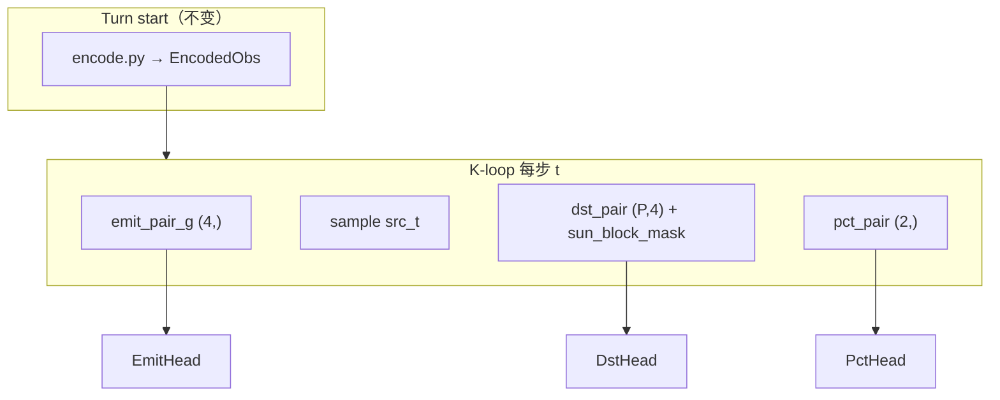

# DAY7 进展 — buf_mix 结论 → f25 特征 → f26 pair head

> **2026-05-28 更新**  
> 接续 [`DAY6_PROGRESS.zh.md`](DAY6_PROGRESS.zh.md)。  
> **项目综述（架构图 + 全流程）**：[`OVERVIEW.zh.md`](OVERVIEW.zh.md)

---

## 0. TL;DR — 当前状态

| 维度 | 状态 |
|---|---|
| **buf_mix** | ✅ 完成；@299 bin0=59% → **参数调参无效** |
| **v11_f25** | ✅ @299 replay；bin0 **9.1%** ✅，spf/garr/flip **全 fail** → pivot f26 |
| **v11_f26** | ✅ 800 upd 训完 + replay；**pair_needed_pct 误导 → bin0 回弹 38%** → **pivot f27** |
| **v11_f27** | ✅ 800 upd + @099/199/299/699/799 全量 replay；**pct fix 单独无效**；bin0 32-38%、spf 2.6-4.8、flip ~1% → **pivot f28** |
| **v11_f28** | ✅ **代码已落地 + 5090 开训中**；resume f27 @799 + mixed_v20_top10 buffer (0.8) + ent_coef_pct=0.012 |
| **当前主线** | **v11_f28**：用 buffer-reset 中段状态破 self-play 1-ship spam 局部最优 |
| **训练** | `bash scripts/run_v11_f28.sh`（resume f27 @799；400 upd） |
| **决策标准** | **replay vs v20 only**（训练 spf/garr 不作 promote 依据） |

### 策略 pivot 链（Day7 五次）

```
buf_mix 参数 sweep 无效
    → f25 turn-start 特征 → bin0 修好(9.1%)，spf/garr 全 fail
        → f26 K-loop pair → garr↑ 但 bin0 回弹 38%、1-ship spam
            → f27 min_bin_norm pct fix → bin0 36%（pct fix 无效）
                → f28 mixed_v20_top10 buffer + ent_pct↑ → 当前
```

**关键诊断（f27 @099/199/299/699/799 全部 replay 后）**：

| ckpt | bin0 | bin5-7 | emit=8 | spf | garr | flip |
|---|---|---|---|---|---|---|
| f27 @099 | 36.6% | 10.0% | 41.5% | 2.59 | 38.9 | 1.0% |
| f27 @199 | 36.7% | 14.6% | 47.0% | 3.04 | 40.7 | 0.8% |
| f27 @299 | 37.6% | 17.3% | 40.2% | 4.77 | 46.4 | 1.0% |
| f27 @699 | 32.7% | 15.5% | 36.0% | 3.56 | 28.1 | 1.0% |
| f27 @799 | ~34% | 22% | ~37% | 3.49 | 24.0 | 1.1% |
| v20 | 1.0% | 51.4% | 0.2% | 17.79 | 196.9 | 15.7% |

- pct min_bin_norm 修复 **完全无效**（bin0 持续 32-38%）
- emit 呈 **U 型**：n0 1%、n1 30%、**n8 40%**、中间 <5%
- 训练 spf=200+ vs replay spf=4.8：self-play 锁死的局部最优**
- **根因不在 pct head**，在 **frozen self-play 把双方都锁在 1-ship 8 路 spam**

**已停止的做法**：frozen_ratio / buffer_reset / ent_coef sweep；在旧 22-dim arch 上 resume；用 f25 模板 export f26 ckpt（已被 `HAS_PAIR_FEATS` 检查拦截）。

---

## 1. 问题诊断（贯穿 Day7）

### 1.1 症状 → 根因

| 阶段 | 症状 | replay 证据 | 根因 |
|---|---|---|---|
| buf_mix | bin0 ~60% 不动 | @299 59.3% @499 57.3% | pct head 缺 **相对容量** 信号；buffer 只改 garr 分布 |
| f25 | bin0 下来了，仍 1-ship spam | @299 bin0 **9.1%**，spf **1.40**，garr **6.87** | turn-start 特征帮了 pct；**dst/emit 仍不知几何/可行性/预算** |
| f26 目标 | 抽干母星、发太阳、多路 1-ship | f26 @799 replay | pair_needed_pct≈0.05 在母星 → **锁 bin0** |
| f27 目标 | 同上 + bin0 回弹 | f26 诊断 | 改 pct pair 为 **min_bin_norm**（最小 flip bin / 7） |

### 1.2 决策铁律（重申）

1. **Promote 只看 replay vs v20**（first-80 gate + WLD + HTML 肉眼）
2. **训练 log 的 spf/garr 高 ≠ 实战好**（self-play 与 v20 对手分布不同）
3. **arch 维度变了 = 从头训**（f25、f26 均不可 resume 旧 ckpt）
4. **ablation 后置**：f26 先 a+b+c 合训一版，跑通 replay 后再拆

---

## 2. buf_mix 阶段（已结束）

### 2.1 配置

| 参数 | buf_from4k | buf_mix |
|---|---|---|
| buffer | v20 only | v20 + top10 50/50 |
| frozen_ratio | 0.50 | 0.35 |
| buffer_reset_ratio | 0.50 | 0.70 |
| resume | 4k @3199 | buf_from4k @799 |

### 2.2 Mid-replay 结果（first-80，5 局 vs v20）

| 指标 | buf_from4k @799 | buf_mix @299 | buf_mix @499 | Day5 目标 |
|---|---|---|---|---|
| bin0 | 61.0% | 59.3% | 57.3% | ↓（<40% 理想） |
| spf | 10.73 ✅ | 6.78 | 8.24 | >10 |
| garr | 107.5 ✅ | 91.12 | 91.11 | >60 ✅ |
| flip | 1.90% | 1.65% | 2.09% | >6% |
| emit=1/turn | ~25% | **74%** | **78%** | ↓ |
| WLD | 0/5 | 0/5 | 0/5 | — |

**结论**：spf/garr 有 buffer 增益，**pct 完全没动**；emit 退化为「单发 bin0 或 8 路 bin0 spam」。

### 2.3 根因表（历史 ckpt 对照）

| run | bin0 | 备注 |
|---|---|---|
| k8_no_emit @800 | **25.4%** | pct 最健康 ckpt（但 spf 低） |
| k8_4k @3199 | 72.1% | self-play 锁 bin0 |
| buf_from4k @799 | 61.0% | buffer 抬 spf 不修 pct |
| buf_mix @299 | 59.3% | top10 buffer 也不修 pct |

**Day7 上决策**：pivot 到 **特征工程（f25）**，不再调 buf_mix 参数。

---

## 3. v11_f25 阶段（已结束 → pivot f26）

### 3.1 做了什么

在 `encode.py` 增加 **+11 维 turn-start 特征**（planet 22→28，fleet 8→10，global 14→17），不改 head 结构：

| 类别 | 特征 | 作用 |
|---|---|---|
| pct 大舰队 | flip_cost_ratio, friendly_surplus, capturable_bin3/5, needed_pct_norm, max_garr_norm | 相对容量 → 推大 pct bin |
| emit 多路 | weak_target_score, n_weak_targets_norm, ships_to_capture_all_weak_norm | 软目标数量 → 推 emit≥2 |
| fleet | target_dist_norm, target_garrison_norm | 远程大舰队暗示 |

- config：`orbit_wars_rl/configs/multi_action_v11_f25.yaml`
- script：`scripts/run_v11_f25.sh`
- ckpt：`ckpt_multi_action_v11_f25/`
- submission：`submission_rl_v11_f25.py`（planet=28, global=17, **无 pair head**）

### 3.2 @299 replay 结果（first-80，5 局 vs v20）

| 指标 | f25 @299 | v20 (B) | Day5 gate | 判定 |
|---|---|---|---|---|
| **bin0** | **9.1%** | 1.1% | — | ✅ 大幅改善 |
| **emit≥2** | **60.0%** | 7.8% | >5% | ✅ |
| **spf** | **1.40** | 16.51 | >10 | ❌ |
| **garr** | **6.87** | 193.06 | >60 | ❌ |
| **flip** | **0.78%** | 18.11% | >6% | ❌ |
| zero_emit | 2.8% | 30.4% | — | — |
| WLD | **0/5/0** | 5/0/0 | — | ❌ |
| captures | 13 | 113 | — | ❌ |

**pct_bin 分布（first-80，A）**：bin0 9.1% / bin1 25.2% / bin2 29.2% / bin3 2.3% / bin4 7.6% / bin5 7.8% / bin6 1.1% / bin7 17.6%

**emit_count（first-80）**：0: 5.8% / 1: 34.2% / 2–8: 60%（多路确实起来了）

### 3.3 f25 诊断（HTML replay + 指标）

| 现象 | 含义 |
|---|---|
| bin0 从 ~60% → 9% | turn-start pct 特征 **有效** |
| emit≥2 60% 但 spf 1.4 | **多路 1-ship spam**，不是大舰队 |
| garr 6.87 | **快速抽干母星**，不留守备 |
| flip 0.78% | 舰队太小/目标不对，**几乎不 flip** |
| 往太阳/出界发 | dst head **缺几何约束** |

**Day7 下决策**：f25 只解决了「选 10%」；没解决「往哪打、该不该再发、这一对送多少」。→ **f26 pair head**。

---

## 4. v11_f26 阶段（已结束 → pivot f27）

### 4.1 设计思路

f25 特征在 **turn 开始时编码一次**；f26 在 **K-step 自回归 loop 内** 按当前 `reserved`、已选 `src/dst` 动态计算，直接喂给三个 head 的 fc1 输入（**不改** planet/fleet/global 编码维度，仍为 28/10/17）。



### 4.2 Pair 特征一览

**DstHead — 每个候选 dst 4 维 + 硬 mask**

| 索引 | 名称 | 公式 / 含义 |
|---|---|---|
| 0 | dist_src_dst_norm | src→dst 距离 / BOARD |
| 1 | sun_risk | 1 − min_dist(path, sun) / SUN_GUARD；≥0.9 → **logit −∞** |
| 2 | ships_needed_norm | (garr_dst+1) / remaining_src |
| 3 | pair_flip_bin5 | floor(rem·0.7) > garr_dst 且为敌/中立 |

**EmitHead — 每步全局 4 维**

| 索引 | 名称 | 含义 |
|---|---|---|
| 0 | n_feasible_pairs_norm | 可 flip 的 (src,dst) 对数 / MAX_PLANETS |
| 1 | best_pair_margin_norm | 最好一对的 margin（log1p 归一化） |
| 2 | home_remain_ratio | 母星 remaining / home_init |
| 3 | total_remain_ratio | 全军 remaining / total_init |

**PctHead — 选定 (src,dst) 2 维**

| 索引 | 名称 | 含义 |
|---|---|---|
| 0 | pair_needed_pct | (garr_dst+1) / remaining_src |
| 1 | pair_flip_bin5_pair | bin5(70%) 能否 flip 该 dst |

### 4.3 Head fc1 输入维度（d_model=128, K=8）

| head | f25 | f26 | Δ |
|---|---|---|---|
| dst_fc1 | 257 = 2·d+1 | **261** = 2·d+5 | +4 pair |
| emit_fc1 | 137 = 2·d+K+1 | **141** = 2·d+K+5 | +4 pair_g |
| pct_fc1 | 385 = 3·d+1 | **387** = 3·d+3 | +2 pair |

`infer_arch_from_flat()` 通过 fc1 shape 自动识别 `has_pair`；export 用模板内 `SUN_BLOCK_THRESH` 行区分 f25/f26，**互混会报错**。

### 4.4 代码清单（已实现）

| 模块 | 路径 |
|---|---|
| pair 特征计算 | `orbit_wars_rl/features/pair.py` |
| JAX heads + K-loop | `orbit_wars_rl/net/heads.py`, `orbit_wars_rl/net/model.py` |
| NumPy 推理镜像 | `orbit_wars_rl/inference/numpy_forward.py` |
| Rollout 扩展 | `orbit_wars_rl/ppo/rollout.py`（+planet_x/y/home_idx） |
| Kaggle 单文件 | `submission_rl_v11_f26.py` |
| config / launch | `orbit_wars_rl/configs/multi_action_v11_f26.yaml`, `scripts/run_v11_f26.sh` |
| replay 路由 | `scripts/quick_replay.sh`（has_pair→f26 模板） |

### 4.5 本地验证（Mac CPU，2026-05-28）

| 检查项 | 结果 |
|---|---|
| parity fresh-init 16 states | **16/16 OK** |
| init → rollout → ppo_loss | fc1 维 141/133/195 ✅ |
| export + parity d_model=128 | **8/8 OK**；agent smoke `[0, π/2, 84]`（pct_bin=5=70%） |
| f26 ckpt + f25 模板 | **正确拒绝**（HAS_PAIR_FEATS mismatch） |

### 4.6 训练配置

| 项 | 值 |
|---|---|
| config | `orbit_wars_rl/configs/multi_action_v11_f26.yaml` |
| script | `scripts/run_v11_f26.sh` |
| ckpt | `ckpt_multi_action_v11_f26/` |
| log | `logs/v11_f26.log` |
| tensorboard | `logs/v11_f26/` |
| seed | 260 |
| updates | 800（ckpt 每 100 upd） |
| ent_coef_pct | **0.004**（比 f25 0.006 略低，pair 先验更强） |
| frozen_ratio | 0.40 |
| buffer | **本 run 不用**（f26 跑通 gate 后再 mix） |
| resume | **禁止** resume f25 或更早 ckpt |

### 4.7 Replay gate（first-80，5 局 vs v20）

| 指标 | f25 @299 | f26 @299 | f26 @799 | v20 | Day5 gate |
|---|---|---|---|---|---|
| **bin0** | **9.1%** | 29.6% | **38.3%** | 1.1% | <20% 参考 |
| **spf** | 1.40 | 1.66 | 2.64 | 16.51 | >10 ❌ |
| **garr** | 6.87 | 22.29 | **42.47** | 193.06 | >60 ❌ |
| **flip** | 0.78% | 0.61% | 0.74% | 18.11% | >6% ❌ |
| **e2+** | 60% | 77.5% | 78.2% | 7.8% | >5% ✅ |
| **WLD** | 0/5 | 0/5 | 0/5 | 5/0/0 | — |

**pct_bin（f26 @799）**：bin0 38.3% / bin1 19.9% / bin2 19.2% / bin7 14.0%；**emit=8 占 42%**（8 路 bin0 spam）

### 4.8 f26 诊断 → f27

| 现象 | 含义 |
|---|---|
| garr 6.87→42.47 | emit pair（home/total remain）**部分有效** |
| bin0 9%→38% | **pct pair 有害**：`(garr+1)/remaining≈0.05` 在母星 → 锁 bin0 |
| spf 1.4→2.6 | 仍 **多路 1-ship** |
| export smoke @799 | 8 路全 pct=0（10% bin） |

**决策**：保留 dst/emit pair；pct 改 **`min_bin_norm`**；`ent_coef_pct` 恢复 **0.006**；不可 resume f26。

---

## 5. v11_f27 阶段（已结束 → pivot f28）

### 5.1 改动 / 训练结果

| 项 | f26 | f27 |
|---|---|---|
| pct pair [0] | `(garr+1)/remaining` | `min_bin_norm` |
| ent_coef_pct | 0.004 | 0.006 |
| 训练 | 800 upd（self-play + frozen pool） | **完成** |
| 结果 | bin0 38% spf 2.64 | **bin0 34% spf 3.49**（无明显改善） |

### 5.2 诊断结论

f27 的 pct 特征语义正确（min_bin_norm 完全表达"需要多大 bin"），但模型 **拒绝学习**：

- ent_coef_pct=0.006 不够强，无法把 bin0 推开
- 即便推开，self-play 对手也 spam → 大舰队没价值 → 梯度回到 bin0
- emit pair 的 `n_feasible_pairs_norm` 在 1-ship spam self-play 下变成"全发"信号

→ **特征工程到顶**，需要换训练对手分布。

---

## 6. v11_f28 阶段（当前主线）

### 6.1 思路

**破 self-play 局部最优**：让 episode reset 从 `data/mixed_v20_top10.npz` 中抽 v20 / top10-winner 的 **中段状态**（high garr / 集中 fleet）。模型一上来就在"母星 200 ships、对手已铺开"的位置上决策，1-ship spam 立刻被惩罚。

### 6.2 相对 f27 的旋钮

| 项 | f27 | f28 |
|---|---|---|
| 起点 | 从头训 | **resume f27 @799** |
| buffer_path | "" | **`data/mixed_v20_top10.npz`** |
| buffer_reset_ratio | 0.0 | **0.80** |
| frozen_ratio | 0.40 | **0.20** |
| ent_coef_pct | 0.006 | **0.012** |
| ent_coef_emit | 0.003 | **0.006** |
| lr_peak | 1.5e-4 | **7e-5**（resume，温和） |
| num_updates | 800 | **400** |
| seed | 271 | 282 |

### 6.3 决策标准（@099 / @199 / @299）

| 结果 | 动作 |
|---|---|
| bin0 < 20% **且** spf > 8 @199 | 继续到 @399 / promote 候选 |
| bin0 仍 > 30% **且** emit=8 仍 > 30% @199 | **abort**，转 f29 (BC pct 暖启动 pct/emit head) |
| spf > 6 但 bin0 仍 25-30% | 继续到 @299；若 @299 bin0 不降则 abort |
| flip > 3% 且 WLD ≥ 1/5 @299 | promote → mixed buffer 续训 800 upd |

### 6.4 训练配置

| 项 | 值 |
|---|---|
| config | `orbit_wars_rl/configs/multi_action_v11_f28.yaml` |
| script | `scripts/run_v11_f28.sh` |
| ckpt | `ckpt_multi_action_v11_f28/`（每 50 upd 一个） |
| log | `logs/v11_f28.log` |
| 状态 | **5090 已开训** |

---

## 7. 下一步：执行命令

### 7.1 监控 f28 训练（5090）

```bash
tail -f logs/v11_f28.log
```

### 7.2 早期 / 中期 / 末期 replay（拉到本地跑）

```bash
# @099（约 12.5% 进度，最早信号）
bash scripts/quick_replay.sh ckpt_multi_action_v11_f28/ckpt_000099.pkl v11_f28_u099
# @199（决策点：abort or 继续）
bash scripts/quick_replay.sh ckpt_multi_action_v11_f28/ckpt_000199.pkl v11_f28_u199
# @299 / @399
bash scripts/quick_replay.sh ckpt_multi_action_v11_f28/ckpt_000299.pkl v11_f28_u299
bash scripts/quick_replay.sh ckpt_multi_action_v11_f28/ckpt_000399.pkl v11_f28_u399
```

### 7.3 若 f28 失败的备选（f29 草案）

| 备选 | 描述 |
|---|---|
| **f29 BC pct/emit** | 用 v20 BC 数据集冻结 encoder，只暖启动 pct/emit head（强先验破 bin0） |
| **f29 hard mask** | 在 K-loop 内若 `ships_to_send < garr_dst` 强制 emit=stop（杀 1-ship spam） |
| **f29 shaping** | 给 `-reward` for fleet whose `ships < arrival_garrison`（直接惩罚 1-ship 撞墙） |

---

## 8. Checklist

### 8.1 buf_mix ✅ / 8.2 f25 ✅ / 8.3 f26 ✅

### 8.4 v11_f27 ✅

- [x] `min_bin_norm` pct pair + submission_f27 + config/script
- [x] sync 5090 + 800 upd 训练完成
- [x] @099/@199/@299/@699/@799 全量 replay → bin0 持续 32-38%
- [x] **诊断：pct fix 单独无效；根因是 self-play 锁死** → **pivot f28**

### 8.5 v11_f28 ✅

- [x] f28 config + run script + resume f27 @799
- [x] 复用 `data/mixed_v20_top10.npz`
- [x] buffer_reset_ratio=0.80 / frozen_ratio=0.20 / ent_pct=0.012
- [x] 400 upd 完成；@099 replay：spf=6.93 garr=62 OK，但 bin0≈37% flip≈1% 不动
- [x] **结论：buffer 拉 spf/garr，但 bin0/flip 仍锁死 → pivot f29（信号栈，非 BC）**

### 8.6 v11_f29 — 三套 overnight 验证 ✅

- [x] f29 信号栈 + 三套 600 upd + @299/@599 replay
- [x] **结论：f29 无 buffer 最优** — bin0 ~10%, e8 ~0%, spf ~13; flip ~3% 仍不足
- [x] f29_buf / f29b 未 beat f29 bin0；f29b u599 退化

### 8.7 v11_f30 — 续训 🟡

- [x] config + run script（resume f29 @599, 800 upd, lr 8e-5）
- [ ] 5090 训练 + @299/@599/@799 replay gate

### 8.8 勿再踩坑

- [ ] **不要** BC pct/emit（用户明确拒绝）
- [ ] **不要** resume f27/f28 ckpt 到 f29（dst_fc1 维变）
- [ ] **不要** 用 `strong_ckpt_path` 塞 v20
- [ ] f29 决策 **不看** 训练 spf；看 replay first-80

---

## 10. v11_f29 设计（当前主线）

### 10.1 f28 结论

| 指标 | f28 @099 | gate |
|---|---|---|
| bin0 | ~37% | FAIL（目标 <20%） |
| spf | 6.93 | OK |
| garr | 62 | OK |
| flip | 1.33% | FAIL |
| emit=8 | ~37% | spam 未破 |

根因：`n_feasible_pairs_norm` 驱动 emit=8；pct 软 `min_bin_norm` 压不住 bin0。

### 10.2 f29 信号变更（相对 f27/f28）

| 变更 | 行为 | 原因 |
|---|---|---|
| **Dst +margin** | `(floor(rem×0.7)−garr)/rem` clip [0,1] | dst 不知「赢多少」→ flip 1% |
| **Emit 删 n_feasible** | 换 `emit_worth_it`（存在 margin>0 的 pair） | feasible 多 → emit=8 占 40% |
| **Pct hard mask** | bin < min_flip_bin → logit −∞ | f27 软 min_bin 无效 |
| **f29b emit hard** | step>0 且 worth_it=0 → continue −∞ | 测硬约束破 spam 速度 |

架构：`dst_fc1` 输入 **2·d+6**（f27 为 2·d+5）。**从头训**。

### 10.3 三套 overnight track（5090 串行）

| Track | config | buffer | emit_hard_stop | seed | upd |
|---|---|---|---|---|---|
| **f29** | `multi_action_v11_f29.yaml` | 无 | false | 291 | 600 |
| **f29_buf** | `multi_action_v11_f29_buf.yaml` | 0.5 | false | 292 | 600 |
| **f29b** | `multi_action_v11_f29b.yaml` | 0.8 | **true** | 293 | 600 |

共用：`ent_coef_pct=0.008`, `ent_coef_emit=0.002`, `ckpt_every=100`

Replay gate：每套 **@299 + @599**（非 @799）

### 10.4 明早决策表（`logs/overnight_f29_summary.txt`）

| 结果模式 | 解读 | 下一步 |
|---|---|---|
| **f29 无 buffer** bin0↓ flip↑ | 信号本身有效 | f30 = f29_buf 续训 800 upd |
| **仅 f29_buf/f29b** bin0↓ | 信号需配合状态分布 | f30 加大 buffer 或 mid-game 特征 |
| **f29b emit8↓ 但 flip ~1%** | 硬 stop 修 spam 不修 combat | f30 dst margin 交互 / turn-start 刷新 |
| **三套 bin0 仍 >30%** | 特征栈仍不够 | f30 turn-start needed_pct 或 planet capturable |
| **任一 flip >3% 且 spf >8** | 方向正确 | promote 该 track 训满 800 upd |

**Overnight 实际结果（2026-05-29）** — 见 `logs/overnight_f29_summary.txt`：

| track | @599 bin0 | spf | garr | flip | e8 |
|---|---|---|---|---|---|
| **f29** | **9.7%** | **13.15** | 44.6 | **3.03%** | **0.2%** |
| f29_buf | 16.8% | 10.17 | 55.3 | 3.09% | 10.5% |
| f29b | 24.0% | 9.47 | 78.2 | 2.94% | 13.0% |

**决策：promote f29 @599 → f30 续训 800 upd（无 buffer，无 emit_hard_stop）。**

### 10.5 f29@599 HTML / 指标肉眼特征（vs f25/f27）

HTML：`logs/replay_html/v11_f29_u599_seed0/replay.html`（5090；seed0 146 步负于 v20）

| 现象 | f25 | f27@799 | **f29@599** | 含义 |
|---|---|---|---|---|
| emit=8 spam | — | ~33% | **0.2%** | worth_it 有效 |
| 每 turn 发射数 | 多路 1-ship | 8 路 | **68% 仅 1 路** | 不再 spam，偏保守 |
| bin0 | 9% | 27% | **9.7%** | hard mask 有效 |
| bin7 占比 | — | — | **66%** | 常选 100% bin（非均匀 bin4–7） |
| spf | 1.4 | 3.5 | **13.15** | 大舰队（聚合） |
| flip | 0.8% | 1.1% | **3.0%** | 有改善，仍远低于 v20 20% |
| garr | 6.9 | 24 | **44.6** | 比 f25 留船，未达 60 |
| z0 | 2.8% | — | **1.0%** | 几乎每 turn 都发 |
| WLD vs v20 | 0/5 | 0/5 | **0/5** | 仍全负 |

**HTML seed0 早期典型行为**：turn 0 常 1 发、bin7（母星 102 ships 全送）；前 80 turn 79/80 为单发 — 进攻频率高但每 turn 集中一路，不像 v20 高 z0 蓄力。

**f30 应攻**：flip 6%+ / garr 60+；保持 bin0 <15%、e8 <5%；不必再加 buffer/hard stop。

### 10.6 v11_f30 续训

| 项 | 值 |
|---|---|
| config | `orbit_wars_rl/configs/multi_action_v11_f30.yaml` |
| script | `scripts/run_v11_f30.sh` |
| resume | `ckpt_multi_action_v11_f29/ckpt_000599.pkl` |
| upd | 800（extension 计数 0..799） |
| lr_peak | 8e-5 |
| buffer / emit_hard_stop | 无 / false |

Replay gate：

```bash
bash scripts/quick_replay.sh ckpt_multi_action_v11_f30/ckpt_000299.pkl v11_f30_u299
bash scripts/quick_replay.sh ckpt_multi_action_v11_f30/ckpt_000599.pkl v11_f30_u599
bash scripts/quick_replay.sh ckpt_multi_action_v11_f30/ckpt_000799.pkl v11_f30_u799
```

Promote（相对 f29@599）：bin0 <15%；flip >6%；garr >60；e8 <5%；WLD ≥1/5 bonus。

### 10.7 f29@599 HTML postmortem（aggregate vs seed0）

5090 replay JSON（5 局聚合）与 seed0 HTML **严重背离**：

| 指标 | aggregate (5 games) | seed0 单局 |
|---|---|---|
| spf | 13.15 | **~1.10** |
| 1-ship launch | — | **~98%** |
| 行为 | bin0/e8 达标 | home=1 时每 turn 1-ship 打空 neutral |

**根因（f29 软门控不足）**：

1. `emit_worth_it=0` 时 f29 **仍 emit**（`emit_hard_stop=false`）
2. pct hard mask 在 avail=1 时无效（bin7=100% 仍 1 ship）
3. 无 dst flip hard mask → 持续打不可攻占 neutral
4. aggregate spf **误导**；需 `min_game_spf` / `one_ship_rate` / `home_le1_emit_rate`

HTML：`logs/replay_html/v11_f29_u599_seed0/replay.html`

### 10.8 f30 中止

f30 = f29@599 续训 800 upd（无 hard stop）。HTML postmortem 后 **kill**：

- 续训不能修复 worth_it 软门控 + 无 flip mask 的根因
- 保留 `multi_action_v11_f30.yaml` / `run_v11_f30.sh` 作记录，**不 promote**

### 10.9 v11_f31 设计（Phase B — 当前）

**目标**：硬门控止 spam + 锁不可 flip 目标；fresh 600 upd。

| 门控 | 公式 | 作用 |
|---|---|---|
| **emit_hard_stop** | step>0 且 worth_it=0 → continue −∞ | home=1 不再连发 |
| **flip_hard_mask** | floor(rem×0.7) ≤ garr[dst] → dst −∞ | 不打不可攻占 neutral |
| pct hard mask | bin < min_flip_bin → −∞ | 保留 f29 |
| soft 特征 | margin / worth_it / capturable@encode | RL 仍学 garrison 策略 |

| 项 | 值 |
|---|---|
| config | `orbit_wars_rl/configs/multi_action_v11_f31.yaml` |
| script | `scripts/run_v11_f31.sh` |
| submission | `submission_rl_v11_f31.py`（`EMIT_HARD_STOP=1`, `F31_HARD_MASKS=1`） |
| seed / upd | 311 / 600 fresh |
| buffer / BC | 无 |

**f31 @599 gate（vs f29 seed0）**：

| 指标 | f29 问题 | f31 目标 |
|---|---|---|
| min_game_spf | ~1.1 | > 5 |
| one_ship_rate | ~98% | < 50% |
| z0 | ~1% | > 10% |
| bin0 / e8 | 9.7% / 0.2% | bin0 <15%, e8 <5% |
| HTML | home=1 连发 80 turn | 无 spam；无锁空 neutral |

```bash
bash scripts/quick_replay.sh ckpt_multi_action_v11_f31/ckpt_000299.pkl v11_f31_u299
bash scripts/quick_replay.sh ckpt_multi_action_v11_f31/ckpt_000599.pkl v11_f31_u599
# seed0 HTML vs f29
```

### 10.10 Phase D 预留（f32，条件触发）

**触发**：f31 @599 未过 §10.9 gate（尤其 min_game_spf / one_ship_rate / HTML flip）。

**方向**：

- `encode.py` 已有 turn-start `[24-26]`：`capturable_bin3/5`, `needed_pct_norm`
- f32：K-loop 内用 **remaining garrison** 刷新 planet-level capturable / needed_pct
- 注入 PctHead/DstHead，让策略在不同敌方 garrison 下学会选目标
- 仍无 BC；fresh 或 f31@599 resume 视 mask 是否仍必要

### 10.11 执行命令

```bash
# f31 parity（16/16，需 emit_hard_stop + flip_hard_mask）
JAX_PLATFORMS=cpu python3 -m orbit_wars_rl.inference.test_parity \
  --num-states 16 --emit-hard-stop --flip-hard-mask

# 5090 f31 训练
bash scripts/run_v11_f31.sh
tail -f logs/v11_f31.log
```

---

## 12. 路径备忘（f29/f31）

| 用途 | 路径 |
|---|---|
| f29 overnight summary | `logs/overnight_f29_summary.txt` |
| f29@599 replay JSON | `logs/replay_analyze/v11_f29_u599_vs_v20.json` |
| f29@599 HTML replay | `logs/replay_html/v11_f29_u599_seed0/replay.html` |
| f30 config（已 abort） | `orbit_wars_rl/configs/multi_action_v11_f30.yaml` |
| f31 config / log | `orbit_wars_rl/configs/multi_action_v11_f31.yaml`, `logs/v11_f31.log` |
| f31 ckpt | `ckpt_multi_action_v11_f31/ckpt_XXXXXX.pkl` |
| f31 submission | `submission_rl_v11_f31.py` |
