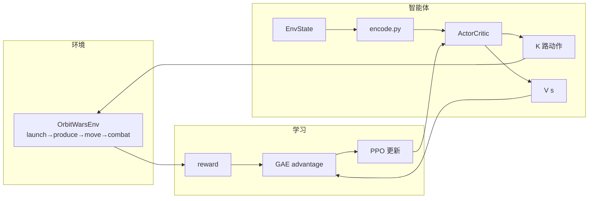
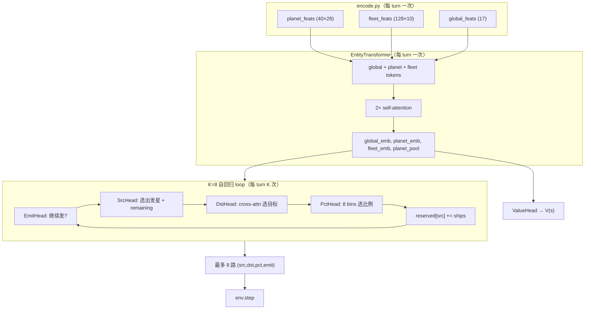
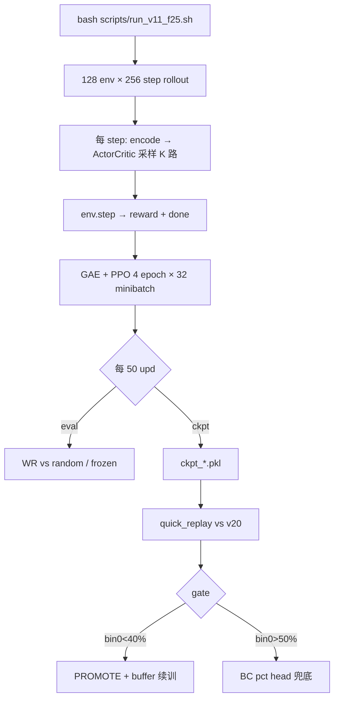

# Orbit Wars RL 项目综述

> **最后更新：2026-05-28**  
> 本文档汇总从 Day1 MVP 到 Day7 **v11_f25 特征工程**的完整流程、架构与决策依据。  
> 日进展见 [`DAY7_PROGRESS.zh.md`](DAY7_PROGRESS.zh.md)（最新策略）；历史见 Day1–Day6 文档。

---

## 0. 一句话现状

**问题**：pct head 锁 bin0（~60% 选 10% 兵力）→ 1-ship spam → vs v20 replay 全败。  
**根因**：不是 hyperparameter，是 **obs 缺少 relative capacity / 多路信号**；state buffer 只改状态分布，不改 pct 学习。  
**当前方案**：**v11_f25** — planet 28 / fleet 10 / global 17 维特征，**从头 self-play 800 upd**，replay gate 决策。

---

## 1. 项目演进时间线

| 阶段 | 路线 | 关键结论 |
|---|---|---|
| Day1–2 | MVP 单动作 → 多动作 head 设计 | 必须支持每 turn 多条 fleet（Kaggle API） |
| Day3–4 | v7/v9 entity transformer + PPO | 架构跑通；replay vs v20 仍弱 |
| Day5 | Ablation：K=8 vs K=16、关 R4 | K=16 + R4 → emit spam；**K=8 + R4 OFF** 为基线 |
| Day6 | k8_no_emit 4k + buf_from4k | garr/spf ↑，**bin0 仍 61–72%** |
| Day7 上 | buf_mix（v20+top10 buffer） | @299/@499 bin0 **57–59%**，参数调参无效 |
| **Day7 下** | **v11_f25 特征工程** | 停止调参；+11 维 pct/emit 归纳偏置；从头训 |

**决策铁律**：**replay vs v20 是唯一 promote 标准**；训练 spf/garr 高 ≠ 实战好。

---

## 2. 强化学习：这是什么、怎么体现

本仓库是 **Actor-Critic + PPO**，不是监督学习。Transformer 只是 policy 的 backbone。



| RL 要素 | 实现 | 说明 |
|---|---|---|
| 环境 | `orbit_wars_rl/env/` | JAX jit；2P/4P；公转已支持 |
| 策略 π(a\|s) | `net/model.py` ActorCritic | 随机采样 src/dst/pct/emit |
| 价值 V(s) | `ValueHead`（multi-query cross-attn） | PPO critic |
| Reward | `env/rewards.py` | 稀疏 ±1 + shaping（R1/R2/R5 等） |
| 更新 | `ppo/update.py` | GAE + clip + 分 head entropy |
| 对手 | `ppo/runner.py` self-play | random → frozen snapshot pool |
| Curriculum | buffer reset | v20/top10 中期状态注入 reset |

**与 BC 区别**：PPO 从 reward 学；BC（`bc/train_bc.py`）是兜底，直接模仿专家 pct 分布。

---

## 3. 模型架构（Entity Transformer + 自回归多路）

### 3.1 总体数据流



### 3.2 特征 → Transformer → Head 的交互

1. **Raw features** 经 `Dense(d_model)` 投影 + **type embedding**（global/planet/fleet）。
2. **Self-attention** 让所有 planet token 与 global/fleet 交换信息 → 每个 `planet_emb` 已含全局上下文。
3. **Encoder 只跑一次**；K 步 loop **复用**同一套 embedding。
4. 各 head 读不同 slice：
   - **SrcHead**：`planet_emb` + 动态 `remaining_norm`（reserved 后剩余兵力）
   - **DstHead**：src 作 query，cross-attn 到 `planet_emb` + `reserved_norm`
   - **PctHead**：`src_emb + dst_emb + global_emb + src_remaining_norm`
   - **EmitHead**：`global_emb + planet_pool + step_onehot + total_remaining_norm`
   - **ValueHead**：4 query cross-attn 到全部 planet+fleet

### 3.3 自回归是什么意思

**不是** GPT 逐 token 生成整局；而是 **一个 env step（一回合）内，最多顺序发射 K=8 支舰队**：

- t=0：**强制 emit**（有兵则至少发 1 路）
- t=1..7：EmitHead 决定 continue/stop
- 每步更新 `reserved`，下一步 SrcHead 看到扣减后的 remaining
- PPO 把整 turn 的 K 步 logp **求和**为一个复合动作的 log π(a|s)

这与 Kaggle API「每 turn 返回 move list」一致；与 Lux / top player 的「分拆 target + fraction head」同思路。

### 3.4 K=8 是否合理

| 对比 | 数值 | 结论 |
|---|---|---|
| 游戏规则上限 | 无硬 cap | API 允许多条 move |
| v20 启发式 | `MAX_TOTAL_MOVES=26` | 我们 **刻意设小** |
| v20 实战 emit | 多数 turn 0–2 路，emit=8 **<1%** | K=8 覆盖常见多路 |
| v20 极端合击 | 最多 8 source 打 1 目标 | K=8 **刚好边界**，late game 可能紧 |
| K=16 ablation | bin0 spam 恶化 | **K=8 更稳** |

**结论**：K=8 是当前训练阶段的合理默认；f25 跑通后若 emit 常顶满 8 且 bin 健康，再考虑 K=12。

---

## 4. 当前特征集（v11_f25）

维度：**planet 28 / fleet 10 / global 17**（旧 v11：22/8/14）。

### 4.1 Planet（28 维）

| idx | 名称 | 作用 | 主要服务 head |
|---|---|---|---|
| 0–2 | owner one-hot | 敌我中立 | 全部 |
| 3–8 | 位置/半径/兵力/产兵/距太阳 | 基础几何 | 全部 |
| 9–10 | inbound friend/foe | 入轨近似 | dst/pct |
| 12–18 | 公转 + lead target t+15/30 | 轨道预测 | dst |
| 19–21 | threat_ratio, net_inbound, eta_foe | 威胁感知 | dst/pct |
| **22** | flip_cost_ratio | 目标守备 / 我方**平均**守备 | **pct** |
| **23** | friendly_surplus | 入轨−守备，是否已够 | pct/dst |
| **24** | capturable_bin3 | bin3(40%) 能否翻 | **pct** |
| **25** | needed_pct_norm | 目标守备 / 我方**最大**守备 | **pct（大舰队）** |
| **26** | capturable_bin5 | bin5(70%) 能否翻 | **pct（大舰队）** |
| **27** | weak_target_score | 敌/中立软目标分数 | **dst/emit（多路）** |

### 4.2 Fleet（10 维）

| idx | 名称 | 作用 |
|---|---|---|
| 0–7 | 敌我/位置/航向/log ships | 基础 |
| **8** | target_dist_norm | 到推断目标的距离 |
| **9** | target_garrison_norm | 推断目标守备 |

### 4.3 Global（17 维）

| idx | 名称 | 作用 |
|---|---|---|
| 0–13 | step/资源占比/phase/舰队数等 | 全局态势 |
| **14** | max_garr_norm | 我方最强 stack |
| **15** | n_weak_targets_norm | 软目标数量 → **emit 多路** |
| **16** | ships_to_capture_all_weak_norm | 打遍软目标总成本 |

### 4.4 pct bins

8 档：`0.10, 0.20, 0.30, 0.40, 0.55, 0.70, 0.85, 1.00`（`env/constants.py`）。

---

## 5. 端到端训练流程



### 5.1 启动（当前主线）

```bash
bash sync_mirror_ultrapp.sh          # 同步代码到 5090
bash scripts/run_v11_f25.sh          # 从头训，不 resume 旧 ckpt
tail -f logs/v11_f25.log
```

| 项 | 值 |
|---|---|
| config | `orbit_wars_rl/configs/multi_action_v11_f25.yaml` |
| ckpt | `ckpt_multi_action_v11_f25/` |
| seed | 250 |
| num_updates | 800 |
| ent_coef_pct | 0.006 |
| frozen_ratio | 0.40 |
| **不 resume** | 特征维度变了，旧 ckpt 不兼容 |

### 5.2 Replay gate（first-80 vs v20，5 局）

```bash
bash scripts/quick_replay.sh \
    ckpt_multi_action_v11_f25/ckpt_000299.pkl v11_f25_u299

bash scripts/quick_replay.sh \
    ckpt_multi_action_v11_f25/ckpt_000799.pkl v11_f25_u799
```

| 指标 | v20 参考 | 目标 | 优先级 |
|---|---|---|---|
| bin0 | ~0–5% | **< 40%**（@299 先看 <50%） | P0 |
| bin0+bin1 | ~4% | **< 30%** | P0 |
| spf | ~18–20 | **> 4.76** | P1 |
| garr | ~150–200 | **> 60** | P1 |
| flip | ~13% | **> 3%** | P2 |
| emit≥2 | ~14% | **> 5%** | P2 |

### 5.3 @799 决策树

| 结果 | 下一步 |
|---|---|
| bin0 < 40% 且 spf > 4 | **PROMOTE** → 加 mixed buffer 续训 400 upd |
| bin0 < 40% 且 spf < 4 | 续训 800 upd（+ buffer） |
| bin0 > 50% | **B1 BC**：`orbit_wars_rl/bc/train_bc.py` |

---

## 6. 与 top player（lightmk）方案对照

| 维度 | top player | 我们 v11_f25 |
|---|---|---|
| Backbone | Entity Transformer | ✅ 同 |
| Action 分拆 | target + fraction head | ✅ Src/Dst/Pct/Emit |
| pct | discrete bins | ✅ 8 bins |
| 特征 bias | percentage / capture 相关 | ✅ flip_cost, capturable_bin*, weak_target |
| 候选集 heuristic | 不用，全 head RL | ✅ |
| 每 turn 上限 | 未公开 | **K=8**（v20 用 26，我们保守） |
| 多路机制 | FireHead（未细讲） | autoregressive + EmitHead |

**一致**：大方向与榜首帖一致。  
**差异**：K 上限更保守；t=0 强制 emit（v20 常 zero emit）——后续可选改。

---

## 7. 已证伪的路线（勿重复）

| 路线 | 证据 | 结论 |
|---|---|---|
| 调 frozen_ratio / buffer_reset / ent_coef | buf_mix @299/@499 bin0 仍 57–59% | ❌ 修不动 pct |
| 纯 state buffer（v20 / mix） | buf_from4k bin0 61% | ✅ 抬 spf/garr，❌ 不修 pct |
| K=16 + R4 ON | G1 bin0 高、spam | ❌ |
| 只看训练 ent[p] / spf | G1/4k 教训 | ❌ 必须 replay |
| resume 旧 ckpt 到 f25 | arch 维度不匹配 | ❌ 必须从头 |

---

## 8. 文档索引

| 文档 | 内容 |
|---|---|
| **本文** | 综述、架构图、当前方案 |
| [`DAY7_PROGRESS.zh.md`](DAY7_PROGRESS.zh.md) | Day7 最新策略与 checklist |
| [`DAY6_PROGRESS.zh.md`](DAY6_PROGRESS.zh.md) | ablation + 4k + buf_from4k |
| [`DAY5_PROGRESS.zh.md`](DAY5_PROGRESS.zh.md) | K=8 ablation、replay gate 定义 |
| [`RL_PIPELINE.md`](RL_PIPELINE.md) | 早期 MVP 管线（部分过时，以本文为准） |
| [`FAST_ITER_RUNBOOK.md`](FAST_ITER_RUNBOOK.md) | replay 快速迭代 |
| [`top_players_rl.txt`](../top_players_rl.txt) | 榜首 RL 经验帖 |

---

## 9. 关键路径速查

| 用途 | 路径 |
|---|---|
| 特征编码 | `orbit_wars_rl/features/encode.py` |
| 模型 | `orbit_wars_rl/net/model.py` |
| PPO | `orbit_wars_rl/ppo/runner.py` |
| 当前 config | `orbit_wars_rl/configs/multi_action_v11_f25.yaml` |
| 启动脚本 | `scripts/run_v11_f25.sh` |
| replay | `scripts/quick_replay.sh` |
| v20 对照 | `submission_v20_0513.py` |
| mixed buffer | `data/mixed_v20_top10.npz`（f25 成功后可选续训） |

