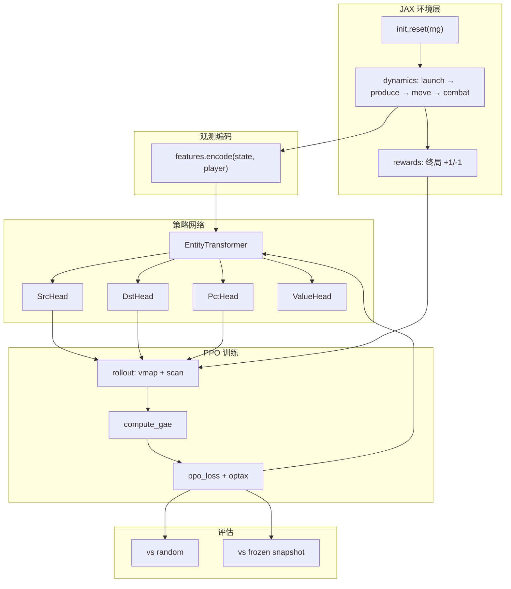

# Orbit Wars JAX Transformer-RL 完整流程说明

本文档说明本仓库 `orbit_wars_rl/` 下的 **端到端强化学习管线**：从 JAX 环境、实体 Transformer 策略网络、PPO 训练，到评估与上云扩展。面向已跑通 `smoke_test`、准备正式训练或上 GPU 的场景。

相关文件：

| 用途 | 路径 |
|------|------|
| 代码根目录 | [`orbit_wars_rl/`](../orbit_wars_rl/) |
| 训练配置 | [`orbit_wars_rl/configs/mvp.yaml`](../orbit_wars_rl/configs/mvp.yaml) |
| 依赖 | [`requirements-rl.txt`](../requirements-rl.txt) |
| 启发式 bot（对照用） | [`submission_v20_0513.py`](../submission_v20_0513.py) |
| 榜首 RL 经验帖 | [`top_players_rl.txt`](../top_players_rl.txt) |
| 比赛规则 | [`overview.txt`](../overview.txt)、[`README.md`](../README.md) |

---

## 1. 目标与 MVP 边界

### 1.1 本轮要交付什么

- 在 **Mac CPU** 或 **单卡云 GPU** 上跑通完整闭环：采样 → PPO 更新 → 对 `random` 评估胜率。
- 默认配置约 **60 万 env steps**（300 updates × 16 envs × 128 rollout），CPU 上约 30–60 分钟量级。
- 期望曲线：`eval/win_rate` 相对 random 从 **0.5 升到 >0.8**（smoke 里 10 个 update 看到 0.62 属于正常起步，不代表已训满）。

### 1.2 MVP 相对真实 Orbit Wars 的简化

这些简化是**刻意**的，便于先把 JIT + Transformer + PPO 跑稳；v2 再逐项补齐。

| 维度 | MVP | 真实 Kaggle 环境 |
|------|-----|------------------|
| 行星运动 | 静态，无公转 | 内侧行星绕太阳旋转 |
| 彗星 | 无 | 定时生成、沿路径移动 |
| 碰撞 | 舰队**端点**进行星半径即命中 | 连续线段 + 太阳遮挡 + 行星扫过 |
| 玩家 | 仅 2P | 2P / 4P |
| 动作 | 每回合 1 次：`src × dst × 兵力比例 bin` | 每回合最多多条 `[planet_id, angle, ships]` |
| 角度 | `atan2(dst - src)` 直线瞄准 | 可含 lead intercept、太阳绕行等 |
| 状态形状 | 固定 `40` 行星槽、`128` 舰队槽 + mask | 动态列表 |

**重要**：`parity_check` 已在「静态行星子集」上与 `kaggle_environments` 对账为 **0 diff**；不等于提交到真环境就能直接高分，上提交前仍需在真 env 上测胜率。

---

## 2. 总体架构



**核心设计原则**（与榜首 @lightmk 路线一致）：

1. **状态全是 `jnp` 固定 shape**，用 `planet_mask` / `fleet_mask` 区分 padding，才能 `jit` + `vmap`。
2. **整段 rollout 在一张 JIT 图里**：`jit(vmap(scan(step_and_act)))`，避免 Python 控制流进入热路径。
3. **动作头基于实体 attention**，不是固定维 MLP logits；行星数量变化由 mask 处理。

---

## 3. 目录与模块职责

```
orbit_wars_rl/
├── env/
│   ├── state.py       # EnvState：全部 jnp 数组
│   ├── constants.py   # MAX_PLANETS=40, MAX_FLEETS=128, ...
│   ├── init.py        # reset：4 对称行星组 + 2P 对角 home
│   ├── dynamics.py    # launch / produce / move / combat（jit-pure）
│   ├── actions.py     # 离散动作 → 舰队发射参数
│   ├── rewards.py     # 2P 终局 ±1
│   └── env.py         # OrbitWarsEnv：reset / step / step_and_autoreset
├── features/
│   └── encode.py      # EnvState → planet/fleet/global 特征 + mask
├── net/
│   ├── transformer.py # EntityTransformer（2 层，d=64）
│   ├── heads.py       # Src / Dst / Pct / Value 头
│   └── model.py       # ActorCritic：采样 + evaluate（PPO 用）
├── ppo/
│   ├── rollout.py     # 并行环境采样
│   ├── update.py      # GAE + PPO loss + train_step
│   └── runner.py      # 训练主循环、ckpt、日志
├── selfplay/
│   ├── pool.py        # 历史权重快照池（v2 league 用）
│   └── eval.py        # vs random / vs frozen
├── scripts/
│   ├── parity_check.py
│   ├── smoke_test.py
│   └── train.py
└── configs/
    └── mvp.yaml
```

---

## 4. 环境层（`orbit_wars_rl/env/`）

### 4.1 状态 `EnvState`

所有字段为 **固定长度** `jnp` 数组（见 `state.py`）：

- 行星：`planet_owner`, `planet_x/y`, `planet_radius`, `planet_ships`, `planet_prod`, `planet_mask`
- 舰队：`fleet_owner`, `fleet_x/y`, `fleet_angle`, `fleet_ships`, `fleet_mask`
- 标量：`step`, `done`, `rng`

`owner` 编码：`-2` padding，`-1` 中立，`0/1` 玩家。

### 4.2 单步顺序（对齐官方 Turn Order 的静态子集）

`env.step` 内部调用 `dynamics.py`：

1. **launch_fleets** — 双方各 1 个离散动作 → 扣行星兵力、在空闲舰队槽生成新舰队  
2. **produce** — 已占领行星按 `planet_prod` 产兵  
3. **move_and_collide** — 按 `fleet_speed(ships)` 移动；出界 / 穿太阳 / 端点碰行星 → 标记命中或消失  
4. **resolve_combat** — 按行星聚合到达兵力，按规则结算（最大攻方 vs 次大，再 vs 守军）  
5. **终止** — `step >= episode_steps` 或仅剩 ≤1 个存活玩家  

### 4.3 奖励

- 进行中：**0**
- 终局：**+1 胜 / -1 负**（按双方总兵力：行星 + 在途舰队比较，见 `rewards.py`）

这是稀疏奖励；学习慢是正常的，需要足够 env steps。

### 4.4 离散动作空间

每个玩家每回合一个三元组（`actions.py`）：

| 字段 | 含义 |
|------|------|
| `src_idx` | 己方行星槽索引（须在 `my_planet_mask` 内且有兵） |
| `dst_idx` | 目标行星槽索引（不能等于 src） |
| `pct_bin` | 兵力比例：0→25%, 1→50%, 2→75%, 3→100% |

发射角：`angle = atan2(dst - src)`，无提前量。

无效动作（不拥有、无兵、目标无效）会被 **静默丢弃**，不发射舰队。

---

## 5. 观测与特征（`features/encode.py`）

从 **当前玩家视角** 编码为三类张量，供 Transformer 使用：

| 类型 | 形状 | 维数 | 主要内容 |
|------|------|------|----------|
| `planet_feats` | `[40, Fp]` | Fp=12 | 敌我中立 one-hot、坐标归一化、半径、log 兵力、产兵、距太阳、 inbound 近似 |
| `fleet_feats` | `[128, Ff]` | Ff=8 | 敌我、坐标、sin/cos 航向、log 兵力 |
| `global_feats` | `[10]` | — | 步数比例、双方兵力/行星/产兵占比、早/中/后期 one-hot |

同时输出：

- `planet_mask` / `fleet_mask` — attention padding  
- `my_planet_mask` / `enemy_planet_mask` — 给 Src/Dst 头做合法动作 mask  

**padding 行特征恒为 0**，避免无效实体干扰 softmax。

---

## 6. 策略网络（`net/`）

### 6.1 Entity Transformer

- 默认：`d_model=64`, `n_layers=2`, `n_heads=4`, `ff_dim=128`  
- 约 **11 万参数**  
- 将 `global + planets + fleets` 拼成序列，加 type embedding，2 层 pre-norm self-attention  

### 6.2 四个头（与 Lux / 榜首方案同思路）

| 头 | 训练 | 推理 | 说明 |
|----|------|------|------|
| **SrcHead** | 在 `my_planet_mask` 上 softmax 采样 | argmax | 选发射星 |
| **DstHead** | 以 src embedding 为 query 的 cross-attn，在「非己方且有效」行星上 softmax | argmax | 选目标 |
| **PctHead** | 4 bin softmax | argmax | 出兵比例 |
| **ValueHead** | — | 标量 V(s) | 全局 + 池化实体 |

总 log_prob = `log π(src) + log π(dst) + log π(pct)`。

### 6.3 常见熵现象（解读 smoke 日志）

- **`ent_src` 很低**：开局常只有 1 个 home 行星，src 几乎 deterministic → 正常。  
- **`ent_dst` ~2.6**：接近「对所有合法目标均匀」的最大熵 → 短训时正常。  
- **`ent_pct` ~1.2–1.4**：4 档兵力，有一定随机性 → 正常。  

---

## 7. PPO 训练（`ppo/`）

### 7.1 采样 `rollout.py`

- **学习方**：玩家 0，策略网络采样动作。  
- **对手**：玩家 1，默认 `random_opponent_action`（在合法 src/dst 上均匀随机）。  
- **并行**：`num_envs` 个环境 `vmap`，每个环境 `scan` `rollout_length` 步。  
- **episode 结束**：`step_and_autoreset` 自动 reset，不中断 batch。  

单次 update 样本量：

```text
batch_transitions = num_envs × rollout_length
# 默认：16 × 128 = 2048
```

### 7.2 更新 `update.py`

| 机制 | 配置（mvp.yaml） |
|------|------------------|
| 优化器 | Adam + **warmup_cosine** lr |
| lr 峰值 / 下限 | 3e-4 / 1e-5 |
| PPO clip | 0.2 |
| Value clip | 0.2 |
| GAE | γ=0.997, λ=0.95 |
| 每轮 update | 4 epochs × 4 minibatches |
| 熵系数 | src 0.005 / dst 0.01 / **pct 0.02**（pct 最高，防塌缩） |
| 梯度 | global norm clip 0.5 |

监控指标含义：

| 指标 | 健康范围（经验） | 异常时 |
|------|------------------|--------|
| `loss` | 可正可负，无 NaN | NaN → 查 lr / 梯度 |
| `clip_frac` | 0.05–0.2 常见；长期 >0.3 | 降 lr 或减网络改动 |
| `approx_kl` | 0.01–0.05 有更新时 | 长期 0 → 几乎没学到；过大 → 步长太大 |
| `ent_dst` | 缓慢下降 | 很快 →0.5 可能过早收敛 |
| `eval/win_rate` | 逐步 >0.5 | 长期 0.5 → 加长训练或查 reward |

### 7.3 主循环 `runner.py`

每个 **update**：

1. `rollout_fn(params, states, rngs)` → `Rollout` 张量 `[T, B, ...]`  
2. `train_step` → GAE + PPO 多 epoch  
3. 每 `eval_every` 次 → `play_vs_random` 估胜率  
4. 每 `ckpt_every` 次 → 保存 `ckpt_XXXXXX.pkl`  

---

## 8. 推荐使用流程（从零到正式训）

### 8.1 安装

```bash
cd /path/to/OrbitWarRL
pip install -r requirements-rl.txt
```

**GPU（可选）**：需安装带 CUDA 的 `jaxlib`，否则会看到：

```text
An NVIDIA GPU may be present ... but a CUDA-enabled jaxlib is not installed. Falling back to cpu.
```

smoke / 小规模调试可用 CPU；上云 5090/A100 再装 GPU 版 JAX。

### 8.2 三步验证（建议顺序）

**① 环境与 Kaggle 对账**

```bash
python -m orbit_wars_rl.scripts.parity_check --seeds 0 1 2 --turns 20
```

期望：`total_per_planet_diffs=0`（静态行星子集）。

**② 烟雾测试（约 15–30 秒）**

```bash
python -m orbit_wars_rl.scripts.smoke_test
```

期望：

- `any NaN? False`
- `eval/win_rate` 若干 update 后 **> 0.5**（你的一次运行：upd 4 → 0.50，upd 9 → **0.62**，正常）
- SPS 首遍低、后升至 **200–400+**（CPU）

**③ 正式训练**

```bash
python -m orbit_wars_rl.scripts.train \
  --config orbit_wars_rl/configs/mvp.yaml \
  --log-dir ./logs/mvp_run1
```

可选缩短试跑：

```bash
python -m orbit_wars_rl.scripts.train --config orbit_wars_rl/configs/mvp.yaml --num-updates 50
```

**④ TensorBoard（可选）**

```bash
tensorboard --logdir ./logs/mvp_run1
```

### 8.3 默认训练量估算

| 项 | 默认值 |
|----|--------|
| updates | 300 |
| env steps / update | 16 × 128 = 2048 |
| **总 env steps** | **≈ 614,400** |

| 硬件 | 典型 SPS（编译后） | 粗算时间 |
|------|-------------------|----------|
| Mac CPU | 250–350 | ~30–45 min |
| 单卡 GPU（装好 CUDA jax） | 2k–8k+（视 num_envs） | 数分钟–十几分钟 |

榜首路线参考：约 **6 亿 steps / 3 天**（@lightmk，含评估开销；10k SPS 自述可能偏高）。MVP 先以「曲线上涨」为准，再扩 env 数与 episode 长度。

---

## 9. 配置说明（`configs/mvp.yaml`）

```yaml
train:
  num_envs: 16          # 并行环境数；GPU 可试 64–256
  rollout_length: 128   # 每次 update 每 env 步数
  num_updates: 300
  episode_steps: 200    # 单局最长回合（真比赛 500）
  eval_every: 10
  eval_num_envs: 32
  ckpt_dir: ./ckpt_mvp
  ckpt_every: 50

ppo:
  lr_peak: 0.0003
  ent_coef_src: 0.005
  ent_coef_dst: 0.01
  ent_coef_pct: 0.02    # 最高，防 pct 头过早塌缩
  gamma: 0.997
  gae_lambda: 0.95
```

调参建议（一次只改一项，见 `top_players_rl.txt`）：

- 学不动：略增 `lr_peak` 或 `rollout_length`  
- `clip_frac` 持续偏高：降 `lr_peak` 或减 `update_epochs`  
- `ent_dst` 崩太快：略增 `ent_coef_dst`  
- 想更快看胜率：减小 `eval_every`，或先 `num_updates: 100` 试曲线  

---

## 10. 与你 smoke 日志的对照

你的一次运行（10 updates，默认 smoke 参数）：

```text
upd  0  sps  96   ent[s/d/p] 0.18/2.67/1.21  clip 0.01  kl +0.003
upd  4  ...                              WR 0.50
upd  9  sps 315  ...                              WR 0.62
any NaN? False
```

**结论：正常。**

- SPS 上升 → JIT 预热完成。  
- 无 NaN → 数值稳定。  
- WR 0.62 → 已优于 random。  
- 后期 `kl≈0`、`clip≈0` → 仅 10 个 update，策略变化还很小；**正式 300 updates 后**应看到更明显的 `kl` 与 `clip_frac` 波动。  

---

## 11. 故障排查

| 现象 | 可能原因 | 处理 |
|------|----------|------|
| CUDA 警告 + CPU 慢 | 未装 GPU jaxlib | 训练用 CPU 可接受；上云再装 CUDA 版 |
| parity diff > 0 | dynamics 与 kaggle 不一致 | 修 `dynamics.py`，勿先加长训练 |
| 全程 WR=0.5 | 步数太少 / 对手太强 | 增加 `num_updates`；确认对手是 random |
| loss NaN | lr 过大 / 梯度爆炸 | 降 `lr_peak`，查 `grad_norm` |
| `clip_frac` > 0.3 持续 | PPO 不稳定 | 降 lr；参考榜首帖减架构改动 |
| 训得好、提交差 | sim-real gap | v2：公转/彗星/连续碰撞；真 env 评估 |

---

## 12. 与仓库其他方案的关系

| 方案 | 路径 | 关系 |
|------|------|------|
| 启发式 v20 | `submission_v20_0513.py` | 可作对手或特征参考；**不**与 MVP RL 共用代码 |
| Search + GBC | `lb-highest-1000-...ipynb` | 规划 + 价值模型；与 RL **正交**，可后期融合 |
| 榜首 JAX RL | `top_players_rl.txt` | 本管线的工程参考（SPS、PPO 稳定性、entity transformer） |

本 MVP **不替代** Kaggle 提交：尚无 `main.py` 导出、未接真环境全规则。v2 里程碑见下。

---

## 13. v2 扩展路线（未实现）

1. **环境**：公转 + 彗星 + 连续线段碰撞 → 与 `kaggle_environments` byte-level 一致  
2. **动作**：每回合多舰队（自回归 action head）  
3. **4P** + self-play league（`FrozenAgentPool` 已预留）  
4. **BC 预训练**：`download_replay_datasets.txt` 的 top10 replay  
5. **云 GPU**：`num_envs≥256`、episode_steps=500、追 SPS  
6. **提交**：导出权重或 tree-walk 风格 `main.py`  

---

## 14. 快速命令索引

```bash
# 对账
python -m orbit_wars_rl.scripts.parity_check --seeds 0 1 2 --turns 20

# 烟雾
python -m orbit_wars_rl.scripts.smoke_test

# 训练
python -m orbit_wars_rl.scripts.train --config orbit_wars_rl/configs/mvp.yaml --log-dir ./logs/run1

# TensorBoard
tensorboard --logdir ./logs/run1
```

---

*文档版本：与 `orbit_wars_rl` MVP 实现同步。若代码有变，以 `orbit_wars_rl/README.md` 与源码为准。*
