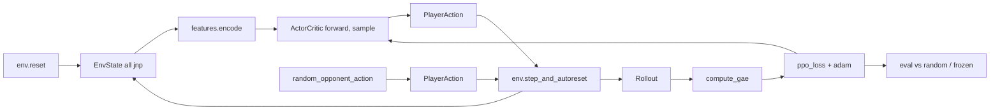

# Orbit Wars JAX Transformer-RL (MVP)

**中文完整流程说明（推荐先读）：** [docs/RL_PIPELINE.md](../docs/RL_PIPELINE.md)

End-to-end JAX + Flax + PPO pipeline for the Kaggle Orbit Wars competition.
The MVP runs entirely on a Mac CPU; the same code scales to a single cloud GPU
when you want to push SPS up.

What's deliberately simplified vs the real game:

- Only static planets (no rotation, no comets, no continuous-segment collision).
- Fixed slot counts (`MAX_PLANETS=40`, `MAX_FLEETS=128`) with masks.
- 2P only.
- Discrete action triple per turn: `(src_planet, dst_planet, percent_bin)`; angle is derived from `src -> dst` geometry, one fleet per turn.

Each simplification is local and well-isolated so we can lift them in v2 without rewriting the rest of the stack. See `../docs/analysis_lb_highest_1000_search_learned_value_function.md` for the broader Orbit Wars context.

## Layout

```
orbit_wars_rl/
  env/        JAX-pure env: state, dynamics, reset/step, rewards, actions
  features/   EnvState -> per-entity feature tensors + masks
  net/        Entity transformer + src/dst/pct/value heads + ActorCritic
  ppo/        Rollout collection, GAE, PPO loss, training runner
  selfplay/   Frozen-agent pool + eval harness (vs random / vs frozen)
  scripts/    parity_check, smoke_test, train entrypoints
  configs/    YAML training config (mvp.yaml)
```

## Install

```bash
pip install -r requirements-rl.txt
```

That installs `jax`, `flax`, `optax`, `chex`, `pyyaml`, `kaggle-environments`, and (optionally) `tensorboard`. For GPU JAX, follow https://github.com/google/jax#installation and pick the matching `jaxlib`.

## Three commands you'll actually run

### 1. Parity sanity-check the JAX env vs the Kaggle env

```bash
python -m orbit_wars_rl.scripts.parity_check --seeds 0 1 2 --turns 20
```

Expected output (we get **zero ship/owner diffs on static planets**):

```
[seed 0] turns=20 skipped_planets=16 total_per_planet_diffs=0 max_ship_diff=0
[seed 1] turns=20 skipped_planets=4  total_per_planet_diffs=0 max_ship_diff=0
[seed 2] turns=20 skipped_planets=4  total_per_planet_diffs=0 max_ship_diff=0
```

The script intentionally skips planets that orbit / are comets in the Kaggle env, since the MVP doesn't model those. Any non-zero `total_per_planet_diffs` is a real bug to fix before training.

### 2. Smoke test the whole training loop

```bash
python -m orbit_wars_rl.scripts.smoke_test --num-envs 8 --rollout-length 32 --num-updates 8 --episode-steps 60
```

Runs ~2k env steps in ~30 seconds on a Mac CPU. Prints loss / entropies / clip frac / eval win rate per update. Exits non-zero if anything turns NaN.

A healthy first run looks like:
```
upd  0  ...  ent[s/d/p] 0.18/2.67/1.21  clip 0.01  kl +0.003
upd  3  ...                                          WR 0.75
upd  7  ...                                          WR 0.62
final SPS: 117 ; any NaN? False
```

The win rate vs `random` should climb above 0.5 within the first few updates. If it stays at 0.5, **stop and read `clip_frac`/`approx_kl`** before scaling up.

### 3. Run the full MVP training

```bash
python -m orbit_wars_rl.scripts.train --config orbit_wars_rl/configs/mvp.yaml --log-dir ./logs/run1
```

Defaults give ~300 updates, ~600k env steps, ~30-60 minutes on a Mac CPU. Open TensorBoard via `tensorboard --logdir ./logs` to watch the curves.

The config is intentionally minimal -- just override CLI flags via `--num-updates` or edit `configs/mvp.yaml`. PPO knobs follow the [top_players_rl.txt](../top_players_rl.txt) playbook (warmup + cosine LR, three independent entropy coefs, value clipping, advantage normalization, grad clipping).

## How the pieces fit together



The entire `rollout_fn` is a single `jit(vmap(scan(...)))` -- there is **no Python control flow on traced values**. Padding rows in `planet/fleet` arrays carry their own boolean masks so all heads use `mask_logits(... , mask)` to keep softmax mass on valid entities only.

## v2 roadmap (not in this MVP)

- Orbiting planets + comets + continuous segment collision (env parity full)
- Multi-action per turn (autoregressive fleet emission)
- 4P mode and richer self-play league
- Imitation-learning warmup from Kaggle replay datasets (top10 episodes)
- Single-file `main.py` packaging for the Kaggle submission box

If you want to push the v2 work, the env interfaces are stable, so most of the work concentrates in `env/dynamics.py` (full physics) and `net/heads.py` (autoregressive multi-action). The transformer encoder and PPO pieces should not need to change.
